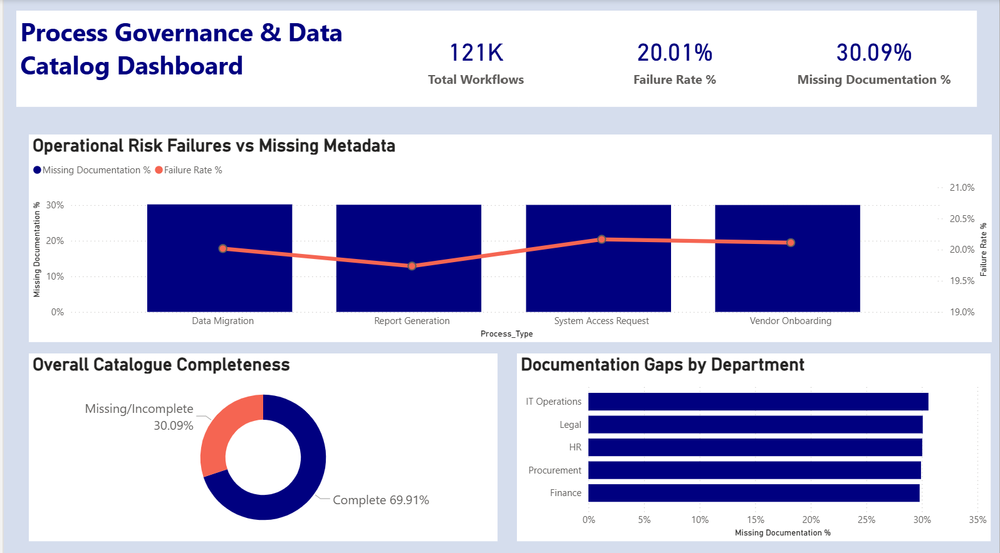

# Enterprise Data Governance & Process Audit

## 📌 Project Overview
As organizations transition between enterprise systems, cross-functional processes often experience high failure rates. This project audits over **120,000 enterprise workflow records** to identify the root cause of these operational breakdowns. 

Rather than technical glitches, the analysis revealed a critical **knowledge management gap**: workflows missing proper metadata and Standard Operating Procedures (SOPs) strongly correlated with systemic failure rates. 

## 🎯 Strategic Objective
To build a scalable Data Governance KPI Framework that identifies documentation gaps, enforces standard taxonomy, and improves overall data discoverability for cross-functional teams.

## 🛠️ Tech Stack & Methods
* **Database Administration (MySQL):** Bypassed client-side security restrictions (`secure-file-priv`) to bulk-load 120,500 enterprise records via `LOAD DATA INFILE`.
* **Data Aggregation (SQL):** Engineered complex aggregate queries (COUNT, SUM, CASE statements) to extract departmental risk metrics and missing documentation rates.
* **Data Visualization (Power BI):** Designed a semantic, high-contrast KPI dashboard to highlight operational risk and catalog completeness for executive stakeholders.

## 📊 Dashboard & Key Insights

1. **The Discoverability Gap:** 30.09% of all enterprise workflows lacked complete metadata or standard operating procedures.
2. **The Root Cause:** The combo chart visualizes a direct correlation—processes with the highest rate of missing documentation (like System Access Requests) also experience the highest workflow failure rates.
3. **Departmental Risk:** IT Operations and Legal carried the highest volume of undocumented processes, indicating a need for targeted change management and peer training interventions.

## 📂 Repository Files
* `Process_Governance_120K_Records.csv`: The raw dataset containing 120,500 workflow logs.
* `Process_Governance_Queries.sql`: The backend SQL script used to aggregate the metrics.
* `Process_Governance_Dashboard.pbix`: The interactive Power BI file.
* `Dashboard_Preview.png`: A high-resolution snapshot of the final reporting framework.
